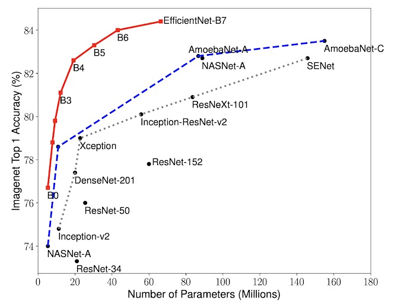
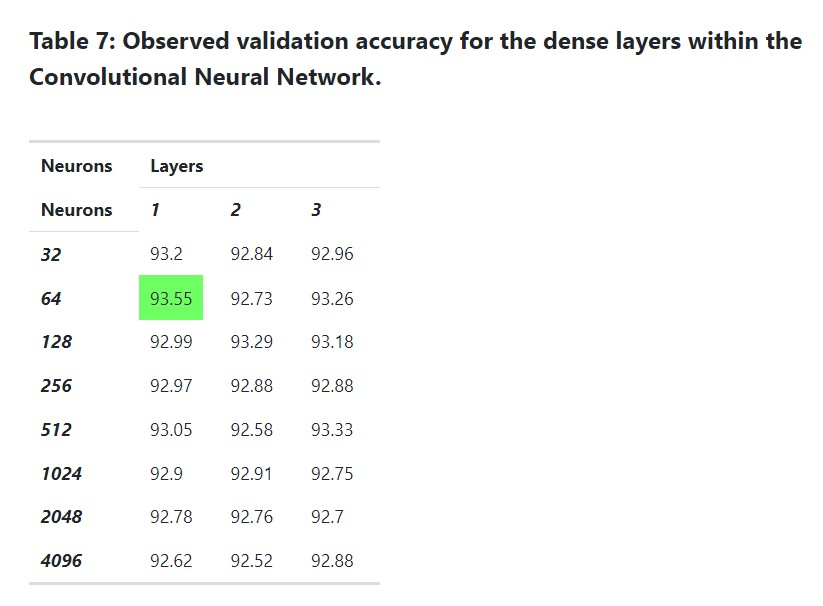

# CNN vs ViT for AI and Real Image Classification

## Overview
This repository contains the implementation and comparison of Convolutional Neural Networks (CNN) and Vision Transformers (ViT) for the classification of AI and real data. The goal is to explore the performance differences between these two popular architectures in the field of computer vision.

## Sample Comparison of CNNs

## Results Achieved in Research Paper

## Working of Depth-Wise Separable Convolution

## EfficientNet Architecture

## Table of Contents
1. [Introduction](#introduction)
2. [Dataset](#dataset)
3. [Models](#models)
4. [Results](#results)
5. [Conclusion](#conclusion)

## Introduction
Convolutional Neural Networks (CNN) have been the backbone of many computer vision tasks for years. However, Vision Transformers (ViT) have gained attention for their ability to handle image classification tasks without relying on convolutional layers. This project aims to compare the performance of CNN and ViT architectures on a dataset containing AI and real images.

## Dataset
The dataset we have used is **CIFAKE: Real and AI-Generated Synthetic Images**

The dataset contains two classes - REAL and FAKE.

For REAL, images are from Krizhevsky & Hinton's CIFAR-10 dataset

For the FAKE images, are generated from the equivalent of CIFAR-10 with Stable Diffusion version 1.4

There are 100,000 images for training (50k per class) and 20,000 for testing (10k per class)

CIFAKE is a dataset that contains 60,000 synthetically-generated images and 60,000 real images (collected from CIFAR-10). 

## Models
The following are the CNNs as well as the ViTs used in our research:

[Click here](https://keras.io/api/applications/) to visit Keras CNN models website.

[Click here](https://huggingface.co/models?pipeline_tag=image-classification&sort=trending&search=vit) to visit HuggingFace ViT models website.

| CNNs                 | 
|------------------------------|
| EfficientNetB4              | 
| EfficientNetB5             |
| EfficientNetB6            |
| InceptionV3               |
| MobileNetV2               |
| MobileNetV3              |
| ResNet101V2              |
| VGG16                     |

| ViTs                | 
|------------------------------|
| amunchet-rorshark-vit-base|
| base-patch16-224  |     
| base-patch32-384.ipynb  |    
| google-vit-base-patch16-224-in21k |  
| tiny-patch16-224  |     
| dima806          |

## Results
We present the results of the model comparison, including accuracy, precision & recall.

| Model Name                   | Accuracy | Precision | Recall | Parameters(M) |
|------------------------------|----------|-----------|--------|------------|
| CNN_EfficientNetB4.ipynb    |  97.35   | 96.08          | 98.72      | 18.15   |
| CNN_EfficientNetB5.ipynb    |  97.54   |  97.41         | 97.69      |  29.06   |
| CNN_EfficientNetB6.ipynb    |    96.29  | 98.89          | 93.64      | 41.57    |
| CNN_InceptionV3.ipynb       |   96.31| 95.95          | 96.7      | 22.35 |
| CNN_MobileNetV2.ipynb       | 93.36| 92.54          | 94.32      | 2.6    |
| CNN_MobileNetV3.ipynb       | 96.47| 97.49          | 95.4      |3.26     |
| CNN_ResNet101V2.ipynb       | 95.15| 95.64          | 94.61      |43.17 |
| CNN_VGG16.ipynb             |   96.57| 97.24          | 95.86      | 14.86    |
| vit-amunchet-rorshark-vit-base.ipynb | 66.95 | 67.9| 66.95 | 85.8  |
| vit-base-patch16-224.ipynb  |   72.35  | 72.29          |   72.35    |86.6  |
| vit-base-patch32-384.ipynb  |  73.65  | 74.61          | 73.65     | 88.3 |
| vit-google-vit-base-patch16-224-in21k.ipynb | 55.5  | 69.2| 55.5 | 86.4 |
| vit-tiny-patch16-224.ipynb  |   83.66  | 84.44          | 83.66      | 5.72 |
| vit_dima806.ipynb           | 98.37           | 98.37         |  98.37     | 85.8           |

## Conclusion

From our experiments we can conclude that:

The best performing model is : **EfficientNetB5** and **Dima806**

and on an average CNNs perform better than ViTs

